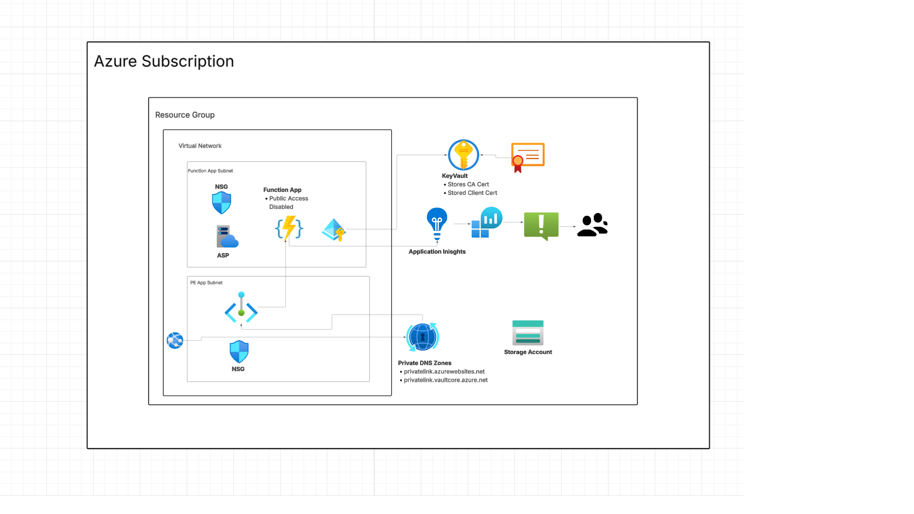

# Checkout Azure Internal API Terraform Solution

## Overview

This repository contains a Terraform based solution for the deployment of a secure internal API in Azure. The design uses an Azure Function App, private networking, certificate generation, Key Vault backed configuration, azure monitoring along with a github workflow for infrastructure validation.

This submission focuses on the core assessment requirements:

- private internal API access
- certificate generation and secure storage in Key Vault
- central logging and alerting
- GitHub Actions validation and plan using OIDC
- clear documentation, setup, teardown, assumptions, AI critique, and estimated costs

## Architecture Summary

The solution is split into reusable Terraform modules for networking, certificates, the Function App, and monitoring.
Directory based environments are provided under `env/dev` and `env/prod`, with dev used as the main worked example.

High level flow:

1. A private virtual network hosts the private endpoint path.
2. The Function App is integrated with the VNet and exposed through a private endpoint.
3. Public network access is disabled on the Function App.
4. The Key Vault is private only and uses private DNS for name resolution.
5. Terraform generates a self signed CA and client certificate material, then stores it in Key Vault.
6. The Function App uses a system assigned managed identity and Azure RBAC to read the trusted CA certificate secret from Key Vault at runtime.
7. The application validates incoming client certificates against that trusted CA certificate.
8. Application Insights, Log Analytics, and Azure Monitor provide observability.

## Architecture Diagram

```
[<h2>Architecture Diagram</h2>
](https://github.com/jalejo37/Checkout_submission/blob/b3a72c3a11ebba14089a901a10dd8d73c1c21e8d/Arch_Diag.png)

```

## Repository Structure

```text
.
├── .github/
│   └── workflows/
├── env/
│   ├── dev/
│   └── prod/
├── module/
│   ├── certificate/
│   ├── functionapp/
│   ├── monitoring/
│   └── networking/
└── src/
    └── Checkout.InternalApi/
```

## What is Implemented

### Infrastructure

- VNet with separate subnets for the Function App and private endpoints
- NSGs attached to both subnets with baseline rules
- Windows Function App with VNet integration
- Function App private endpoint
- Function App private DNS zone
- Function App public network access disabled
- Storage account for the Function App
- Storage account public network access disabled with network restrictions applied
- Key Vault for storing secrets and certificates
- Key Vault public network access disabled
- Key Vault private endpoint and private DNS zone
- System Assigned Managed Identity on the Function App is used to access Azure Key Vault.
- Application Insights
- Log Analytics Workspace
- Azure Monitor action group and alert rule
- Directory based environment structure using `env/dev`


### Function Behaviour

The Function source code is included under `src/Checkout.InternalApi`.
The HTTP triggered function was adapted from an Azure sample and then adjusted to match the assessment requirements.

Implemented endpoints:

- `POST /api/message`
  - expects JSON with a `message` field
  - validates empty or missing input
  - returns the original message, a UTC timestamp, and a request ID
  - logs accepted and rejected requests
  - validates the incoming client certificate against the trusted CA certificate loaded through the `MTLS_CA_CERT_PEM` app setting


## Certificate Flow

1. Terraform generates a CA private key and a self signed CA certificate using the `tls` provider.
2. Terraform generates a client private key and a client certificate signed by that CA.
3. The certificate material is stored in Key Vault.
4. The Function App has a system assigned managed identity.
5. Azure RBAC grants that identity permission to read the trusted CA certificate secret from Key Vault.
6. The certificate module outputs a versionless Key Vault secret URI for the CA certificate.
7. The environment layer passes that secret URI into the Function App module.
8. The Function App uses a Key Vault reference in `MTLS_CA_CERT_PEM` so the application can read the CA certificate through a normal app setting.
9. At runtime, the function code validates the presented client certificate against that trusted CA certificate.

This means the code still reads `MTLS_CA_CERT_PEM` as an environment variable, but the value now comes from a Key Vault reference backed by managed identity and Azure RBAC rather than being passed directly from Terraform output.

## Why Private DNS Zones Are Needed

- A private endpoint gives a service a private IP address, but clients still need DNS to resolve the service name to that private IP instead of a public address.
- The private DNS zone is linked to the VNet, which allows resources in that linked private network to resolve the service privately.
- In this submission, private DNS is used for both the Function App private endpoint and the Key Vault private endpoint.

## Setup and Deployment Guide

### Prerequisites

- Terraform 1.5 or later
- Azure subscription
- Existing Azure Storage Account and container for Terraform remote state
- GitHub repository if using the workflow

### Configure Terraform Variables

Edit `env/dev/terraform.tfvars` and replace placeholder values for:

- `location`
- `tenant_id`
- `alert_email_address`
- `resource_group_name` if you want a different name

### Configure Backend State

Update `env/dev/backend.tf` with the correct backend storage values:

- `storage_account_name`
- `container_name`
- `key`
- `resource_group_name`

### Run Locally

```bash
cd env/dev
terraform init
terraform fmt -check -recursive
terraform validate
terraform plan
```

### Optional Apply

```bash
cd env/dev
terraform apply
```

### Function Code Build

```bash
cd src/Checkout.InternalApi
dotnet restore
dotnet build
```

## GitHub Actions and OIDC

The workflow is in `.github/workflows/deployment_pipeline_dev.yaml`.

This workflow validates the Terraform code for the dev environment before deployment. It currently does the following:

1. Checks out the repository
2. Installs a fixed Terraform version
3. Signs into Azure using GitHub OIDC
4. Checks Terraform formatting across the repository
5. Runs `terraform init` in `./env/dev`
6. Runs `terraform validate` in `./env/dev`
7. Runs `terraform plan` in `./env/dev`
8. Saves a readable text version of the plan
9. Uploads the plan files as pipeline artifacts

The workflow also uses path filters so it only runs when relevant Terraform or workflow files change.

### Why OIDC Is Used

OIDC allows GitHub Actions to authenticate to Azure without storing a long lived client secret in the repository. Instead, GitHub presents a short lived identity token to Azure during the workflow run.

### Azure Configuration for OIDC

To configure OIDC in Azure:

1. Create a Microsoft Entra ID application registration, or use a user assigned managed identity.
2. Add a federated credential that trusts the GitHub repository and the branch or environment you want to allow.
3. Grant that identity the minimum Azure RBAC roles required for the workflow, such as read access for planning or contributor access for deployment.
4. Add the following GitHub repository secrets:
   - `AZURE_CLIENT_ID`
   - `AZURE_TENANT_ID`
   - `AZURE_SUBSCRIPTION_ID`

### Notes

This pipeline currently performs validation and planning only. It does not run `terraform apply`.

The uploaded artifacts include:

- `tfplan`, which is the binary Terraform plan file
- `tfplan.txt`, which is a readable text version of the plan for review

## Assumptions

- The backend state storage account already exists.
- Function code is included in the repository and can be deployed separately after infrastructure creation.
- client service will have ebac access to client cert in Key Vault

## Teardown Instructions

```bash
cd env/dev
terraform destroy
```

### Manual Checks After Destroy

- confirm the resource group contents have been removed
- confirm the remote state blob still exists if you are reusing the backend
- run `terraform state list` and confirm no managed resources remain
- confirm alert emails are no longer being sent

## Estimated Monthly Cost

A detailed cost model was not the focus of this exercise.
Actual cost depends on region, retention settings, telemetry volume, and usage patterns.
For a more accurate estimate, I would use the Azure Pricing Calculator for the chosen region and service configuration.

## AI Usage and Technical Review

AI tools were used selectively during this exercise to assist with understanding unfamiliar implementation details, adapting example code, and troubleshooting Terraform configuration issues.

### Example Prompt Areas

Typical prompts focused on:

- explaining how to generate a self signed Certificate Authority and client certificate using the Terraform `tls` provider
- Understanding why Key Vault Secrets User over Key Vault Certificate User
- clarifying GitHub Actions workflow behaviour and comparing it conceptually to Azure DevOps pipelines
- reviewing Terraform snippets to help identify potential configuration errors
- assisting in understanding and adapting Azure Function sample code to match the requirements of this assessment

These prompts were primarily used to support understanding of specific implementation details rather than to generate the full solution.

### Technical Review of AI Output

AI generated suggestions were treated as starting points and validated against official Terraform and Azure documentation.

During development several adjustments were required:

- certain suggestions proposed simplified infrastructure patterns that needed refinement to meet the networking and security requirements of the scenario. Missing DNS Zones.
- generated snippets occasionally required restructuring to better align with the modular Terraform layout used in this repository
- Adding Azure Icons

AI assistance was mainly used to accelerate understanding and troubleshooting.
The overall infrastructure design, Terraform module structure, networking approach, and security decisions were implemented manually and then reviewed.

### Additional AI Usage

AI assistance was also used to help generate the Terraform scaffolding for the `prod` environment included in the repository.

Because the production environment configuration largely mirrors the development environment structure, this task was mainly repetitive boilerplate rather than architectural design. AI was therefore used to accelerate the creation of the `prod` directory structure and adapt the configuration from the `dev` environment within the limited time available for the assessment.

## Limitations and Future Improvements

### Key Vault Private Limitation

#### Limitation
Because the Key Vault is private only, any machine running Terraform must be able to reach the private endpoint and resolve the vault using private DNS. This means a standard public runner may not be suitable for full deployment activity that needs to write secrets into the vault.

#### Future Solution
A practical next step would be to use a self hosted GitHub Actions runner on an Azure VM inside the same virtual network, or a peered virtual network, so Terraform can securely access the private Key Vault during deployment.

### mTLS Trust Enforcement

#### Limitation
In the current design, client certificate validation is handled within the Function App. This works for the assessment, but it means certificate trust enforcement sits at the application layer rather than being handled centrally at the edge.

#### Future Solution
A stronger production approach would be to move mTLS trust enforcement to Application Gateway or API Management so that certificate validation is handled before traffic reaches the Function App. This would improve separation of concerns and provide a more centralised security model.

### Function Application Deployment Pipeline

#### Limitation
The current pipeline focuses on Terraform validation and planning only. It does not yet include a separate deployment process for the Function App code itself.

#### Future Solution
A practical next step would be to add a dedicated Function App deployment pipeline that builds, packages, and deploys the application code separately from the infrastructure pipeline. This would provide a clearer separation between infrastructure changes and application releases.

### Terraform Tests

#### Limitation
The current solution uses Terraform formatting, validation, and planning, but it does not yet include automated Terraform tests. This means there is less coverage for checking expected module behaviour before deployment.

#### Future Solution
A useful improvement would be to add Terraform tests using `terraform test`, or a more advanced framework such as Terratest, so that the infrastructure modules can be validated more thoroughly as part of the delivery pipeline.
